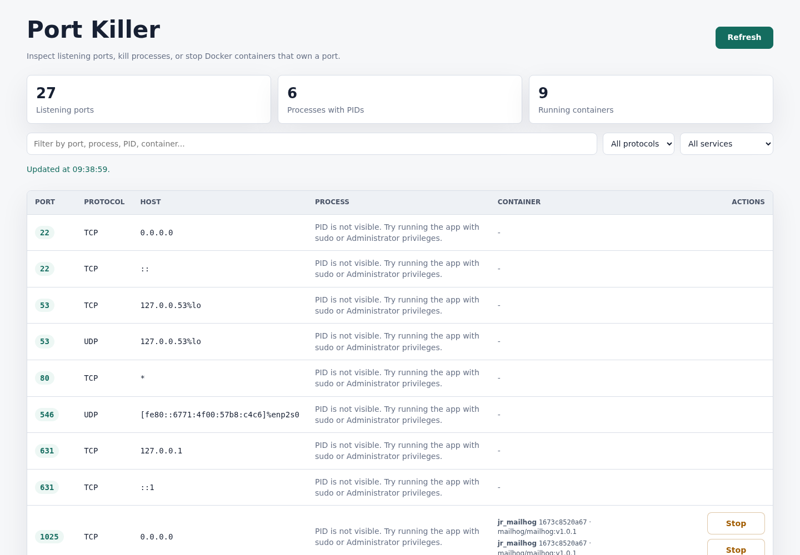

# Port Killer - Cross-Platform Port Manager

[](https://github.com/dannguyen2299/Port-Killer/actions/workflows/release.yml)
[](LICENSE)

Port Killer is a cross-platform port manager for developers who need to find and kill processes using a port. It helps you inspect listening ports, kill a process by PID, and stop Docker containers that own a port on Ubuntu/Linux, macOS, and Windows.

Use it when you hit errors like `EADDRINUSE`, `address already in use`, `port 3000 is already in use`, or Docker containers conflicting on the same port.



## Features

- List listening TCP and UDP ports.
- Show the process name and PID when the OS exposes it.
- Detect Docker containers that publish matching ports.
- Kill a process with `SIGTERM` or `SIGKILL` on Linux/macOS.
- Kill a process with `taskkill` on Windows.
- Stop Docker containers with `docker stop`.
- Browse Ubuntu packages installed through APT/dpkg.
- List the applications visible in the Ubuntu desktop menu and identify their APT, Snap, Flatpak, or manual source.
- Filter installed apps and libraries by type, install origin, and update availability.
- Preview dependent packages before removing an Ubuntu package.
- Package into a single executable per operating system.

## Download

Download prebuilt binaries from GitHub Releases:

- `port-killer-linux`
- `port-killer-macos`
- `port-killer-windows.exe`

The Linux binary currently built in this repository is available at:

```text
dist/port-killer-ubuntu
```

## Common Use Cases

- Find what is using port `3000`, `5000`, `8000`, `8080`, or any local development port.
- Kill a process by port without manually running `lsof`, `ss`, `netstat`, and `kill -9`.
- Stop Docker containers that publish a conflicting port.
- Inspect local listening ports from a simple browser-based UI.
- Share a single executable with teammates who do not want to install dependencies.

## Quick Start

Linux:

```bash
chmod +x port-killer-linux
./port-killer-linux
```

macOS:

```bash
chmod +x port-killer-macos
./port-killer-macos
```

Windows:

```powershell
.\port-killer-windows.exe
```

## Run From Source

```bash
cd ~/Documents/dannv-git/MyProject/port-killer
chmod +x run.sh
./run.sh
```

Open:

```text
http://127.0.0.1:8765
```

If some PIDs are hidden or you cannot kill processes owned by another user, run with elevated privileges:

```bash
sudo PORT=8765 python3 app.py
```

On Windows, run the executable or terminal as Administrator when needed.

## Ubuntu Package Manager

Open the `Apps & Packages` tab to browse desktop applications separately from low-level packages and libraries. Applications are discovered from the system and user `.desktop` entries, including APT, Snap, Flatpak, and manual launchers. Package details include versions, architecture, installed size, and available updates. The inventory works without elevated privileges.

Package removal is intentionally available only when Port Killer runs as root:

```bash
sudo PORT=8765 python3 app.py
```

Before removal, the app runs an APT simulation and shows every package that would be affected. Ubuntu package management currently supports APT/dpkg packages; Snap and Flatpak are not included yet.

## Build A Single Ubuntu/Linux File

```bash
cd ~/Documents/dannv-git/MyProject/port-killer
./build_ubuntu.sh
```

Output:

```text
dist/port-killer-ubuntu
```

Run:

```bash
chmod +x port-killer-ubuntu
./port-killer-ubuntu
```

## Build A Single macOS File

Run on macOS:

```bash
cd path/to/port-killer
chmod +x build_macos.sh
./build_macos.sh
```

Output:

```text
dist/port-killer-macos
```

Run:

```bash
chmod +x port-killer-macos
./port-killer-macos
```

If macOS blocks the downloaded file, allow it in `System Settings` > `Privacy & Security`, or run:

```bash
xattr -d com.apple.quarantine port-killer-macos
```

## Build A Single Windows File

Run in Windows PowerShell:

```powershell
cd path\to\port-killer
.\build_windows.ps1
```

If PowerShell blocks scripts, run the batch file instead:

```bat
build_windows.bat
```

Output:

```text
dist\port-killer-windows.exe
```

Run:

```powershell
.\port-killer-windows.exe
```

Double-clicking the `.exe` also works.

## Release

Create and push a version tag to trigger the GitHub Actions release workflow:

```bash
git tag v0.1.0
git push origin v0.1.0
```

The workflow builds Linux, macOS, and Windows executables and uploads them to the GitHub Release.

## Notes

- Linux uses `ss`.
- macOS uses `lsof`.
- Windows uses `netstat`, `tasklist`, and `taskkill`.
- Docker support requires the `docker` CLI to be installed and accessible.
- PyInstaller should build on the target OS: build Linux binaries on Linux, macOS binaries on macOS, and Windows `.exe` files on Windows.

## Keywords

`port killer`, `port manager`, `kill process by port`, `find process using port`, `docker port conflict`, `listening ports`, `EADDRINUSE`, `address already in use`, `localhost port`, `developer tool`, `linux port killer`, `macos port killer`, `windows port killer`
